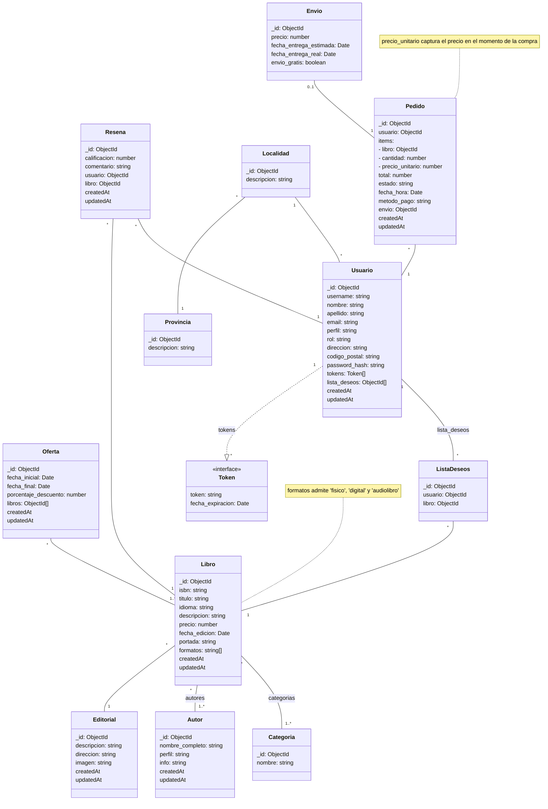

# Propuesta TP DSW

## Grupo

### Integrantes

-   46950 - Retamal, Alejo
-   48042 - Milo, Marina Ana

### Repositorios

-   [Frontend & Backend App](https://github.com/MVRU/Prosefy/tree/main/prototipos)

## E-commerce de Libros "Prosefy"

### Descripción

Prosefy es una plataforma de e-commerce especializada en libros que permite a los usuarios:
- **Explorar un catálogo diverso** filtrando por categoría, autor, formato (físico/digital/audiolibro) y ofertas vigentes.
- **Acceder a detalles enriquecidos de cada libro:** sinopsis, autores, reseñas, calificaciones y opciones de compra.
- **Gestionar compras de forma intuitiva** con carrito, métodos de pago, seguimiento de envíos y comprobantes digitales.
- **Personalizar su experiencia** mediante listas de deseos, seguimiento de autores y perfil de usuario editable.

### Modelo de Datos

## Alcance Funcional

### Mínimo Requerido

| Requerimiento           | Detalle                                                                                                                                                                                                                                  |
| :---------------------- | :--------------------------------------------------------------------------------------------------------------------------------------------------------------------------------------------------------------------------------------- |
| CRUD Simple             | 1. CRUD Autor 2. CRUD Editorial                                                                                                                                                                                                       |
| CRUD Dependiente        | 1. CRUD Libro **{depende de}** CRUD Autor, CRUD Categoría y CRUD Editorial.                                                                                                                                                              |
| Listado + Detalle | 1. Listado de libros filtrado por categoría, muestra ISBN, título, autores, editorial y precio → **detalle CRUD Libro**.  2. Listado de libros filtrado por autor, muestra ISBN, título, editorial y precio → **detalle CRUD Libro**. |
| CUU/Epic                | 1. Comprar libro 2. Ver historial de pedidos                                                                                                                                                                                          |

---

### Adicional para Aprobación

| Requerimiento | Detalle                                                                                                                                                                       |
| :------------ | :---------------------------------------------------------------------------------------------------------------------------------------------------------------------------- |
| CRUD          | 1. CRUD Provincia 2. CRUD Autor 3. CRUD Categoría 4. CRUD Editorial 5. CRUD Localidad 6. CRUD Usuario 7. CRUD Libro 8. CRUD Reseña 9. CRUD Oferta  |
| CUU/Epic      | 1. Comprar libro 2. Eliminar cuenta 3. Gestionar lista de deseos 4. Ver historial de pedidos 5. Buscar libros por criterios avanzados                          |

---

## Tecnologías Utilizadas
- **Frontend:** Angular, Typescript y Bootstrap.
- **Backend:** Node.js y Express.
- **Base de Datos:** MongoDB y Mongoose.
- **Autenticación:** JWT (tokens seguros con expiración).
- **Pruebas unitarias en el Backend:** Jest y Supertest.
- **Pruebas unitarias en Angular:** Karma y Jasmine / Jest (a definir).
- **Seguridad y Rendimiento:** Helmet, cors y express-rate-limit en Express.
- **Pasarela de Pago:** SDK de Stripe / PayPal (a definir).
- **Subir Portadas:** Cloudinary o Firebase Storage (a definir).
- **Envío de Comprobantes por Email:** Nodemailer / SendGrid (a definir).

### Patrones y Arquitectura utilizada
- TypeScript en el backend (con ts-node o compilación previa) para tipado fuerte y mejor mantenibilidad.
- Capa de Controllers / Services / Repositories siguiendo el principio de responsabilidad única.
- Singleton para la conexión a la base de datos.
- Strategy mínima para distintos métodos de pago o cálculo de envíos.
